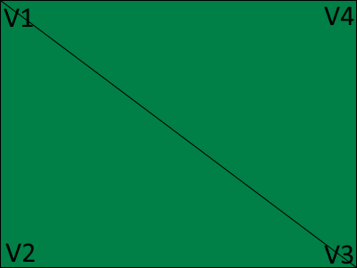

[上一节](../s02/triangle.md)

# 一个四边形

在上一节，我们画出了一个彩色的三角形。在这一节中，我们将简单地绘制一个四边形。

由于现代 OpenGL 不能直接画出四边形，因此我们需要换一种方法。我们知道，一个四边形能分成两个三角形。  
  
在上图中，我们列出了4个顶点，并且将一个四边形分成了两个三角形。每个三角形分别如下：`(v1, v2, v3)`, `(v3, v4, v1)`。

在了解了以上情况后，我们应该如何以`(v1, v2, v3)`, `(v3, v4, v1)`的方式来画图呢？答案是使用`lglIndices`。  
```java
public class OurFirstApplication /* ... */ {
    /* ... */
    void run() {
        /* ... */
        lglBegin(/* ... */);
        lglIndices(0, 1, 2, 2, 3, 0);
        /* ... */
    }
}
```

其实只需要一行`lglIndices(0, 1, 2, 2, 3, 0)`就行了。有两点需要注意的是：
- 所有索引以0开始。所以`(v1, v2, v3)`, `(v3, v4, v1)`应写为`0, 1, 2, 2, 3, 0`。
- 索引中的**0**以当前顶点数的**相对位置**开始。也就是说，如果我们在emit顶点之后才使用indices，那么结果就会变成`4, 5, 6, 6, 7, 4`了。

现在修改一下顶点数据：  
```java
/* ~~IntelliJ IDEA 的最大特性就是没有class会报错~~ */
public class OurFirstApplication /* ... */ {
    /* ... */
    void run() {
        /* ... */
        lglBegin(GLDrawMode.TRIANGLES);
        lglIndices(0, 1, 2, 2, 3, 0);
        lglColor(1.0f, 0.0f, 0.0f);
        lglVertex(-0.5f, 0.5f);
        lglEmit();
        lglColor(0.0f, 1.0f, 0.0f);
        lglVertex(-0.5f, -0.5f);
        lglEmit();
        lglColor(0.0f, 0.0f, 1.0f);
        lglVertex(0.5f, -0.5f);
        lglEmit();
        lglColor(1.0f, 1.0f, 1.0f);
        lglVertex(0.5f, 0.5f);
        lglEmit();
        lglEnd();
    }
}
```

现在你已经学会如何绘制四边形■了，启动程序，然后你会看到一个彩色的四边形。


[下一节](../s04/texture.md)
